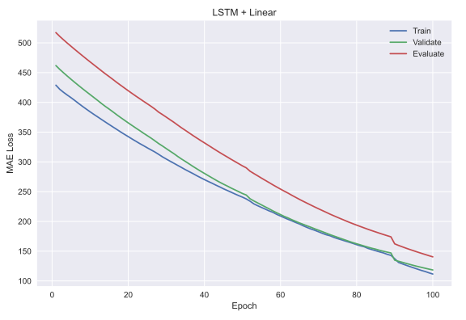
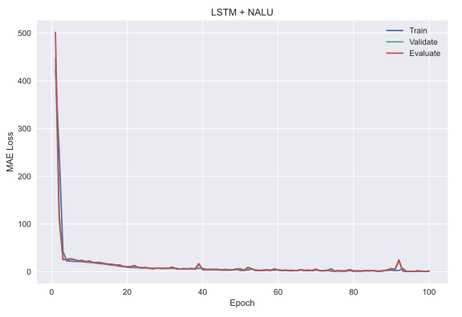

# Neural Arithmetic Logic Units

A PyTorch implementation of [Neural Arithmetic Logic Units](https://arxiv.org/abs/1808.00508) by *Andrew Trask, Felix
Hill, Scott Reed, Jack Rae, Chris Dyer and Phil Blunsom*.

## NAC and NALU architectures

<p align="center">
 
</p>

<div align="center">
  <b>The Neural Accumulator (NAC) is a linear transformation of its inputs. The Neural Arithmetic Logic Unit (NALU) uses two NACs with tied weights to enable addition/subtraction (smaller purple cell) and multiplication/division (larger purple cell), controlled by a gate (orange cell).</b>
</div>


# Experiments

## Experiment 1: Numerical Extrapolation Failures in Neural Networks
MLPs learn the identity function only for the range of values they are trained on. The mean error ramps up severely both below and above the range of numbers seen during training.
Train interval – `[-5, 5]`, Test interval – `[-20, 20]`.

To run the first experiment just use
```bash
python3 train_mlp.py
```

#### Results

* Most of the non-linear activation functions used do not cope with extrapolations.

<p align="center">
 
 
</p>

<div align="center">
  <b>Left figure – results from the paper, Right figure – actual results.</b>
</div>

## Experiment 2: Simple Function Learning Tasks

To run the second experiment just use

```bash
python3 simple_function_learning.py
```

### Interpolation

* RMSE (normalized to a random baseline)

|     |ReLU|None|NAC|NALU|
| --- |  --- | --- | --- | --- |
|a + b|0.001|0.000|0.000|0.002|
|a - b|14.814|0.054|0.000|0.000|
|a x b|20.160|1.630|8.163|0.210|
|a / b|3.673|0.372|1.515|0.008|
|a ^ 2|3.307|4.094|7.943|0.215|
|sqrt(a)|0.396|0.407|2.628|0.068|

### Extrapolation
* RMSE (normalized to a random baseline)

|     |ReLU|None|NAC|NALU|
| --- |  --- | --- | --- | --- |
|a + b|75.051|0.013|0.008|0.000|
|a - b|84.235|0.001|0.046|0.000|
|a x b|96.092|64.749|80.187|53.327|
|a / b|14.941|3.470|16.827|2.702|
|a ^ 2|96.660|67.518|80.774|54.451|
|sqrt(a)|13.923|16.103|53.275|0.403|

## Experiment 3: Language to Number Translation Tasks

To run the third experiment just use

```bash
python3 main.py
```
Mean absolute error (MAE) comparison on translating number strings to scalars. 
LSTM + NALU means a single LSTM layer followed by NALU.

|Model|Train MAE|Validation MAE|Test MAE|
| --- |  --- | --- | --- |
|LSTM + Linear|111.6033|141.3215|140.4769|
|LSTM + NALU|0.6885|0.6727|0.7218|

All experiments used `layer size = 32`, `learning rate = 1e-3`.

<p align="center">
 
 
</p>

<div align="center">
  <b>Left figure – LSTM + Linear Layer, Right figure – LSTM + NALU.</b>
</div>