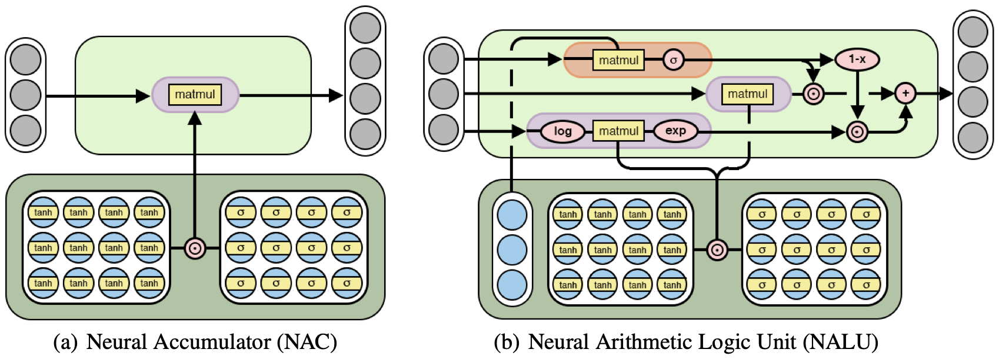

# Neural Arithmetic Logic Units

A PyTorch implementation of [Neural Arithmetic Logic Units](https://arxiv.org/abs/1808.00508) by *Andrew Trask, Felix Hill, Scott Reed, Jack Rae, Chris Dyer and Phil Blunsom*.

## NAC and NALU architectures 

 

