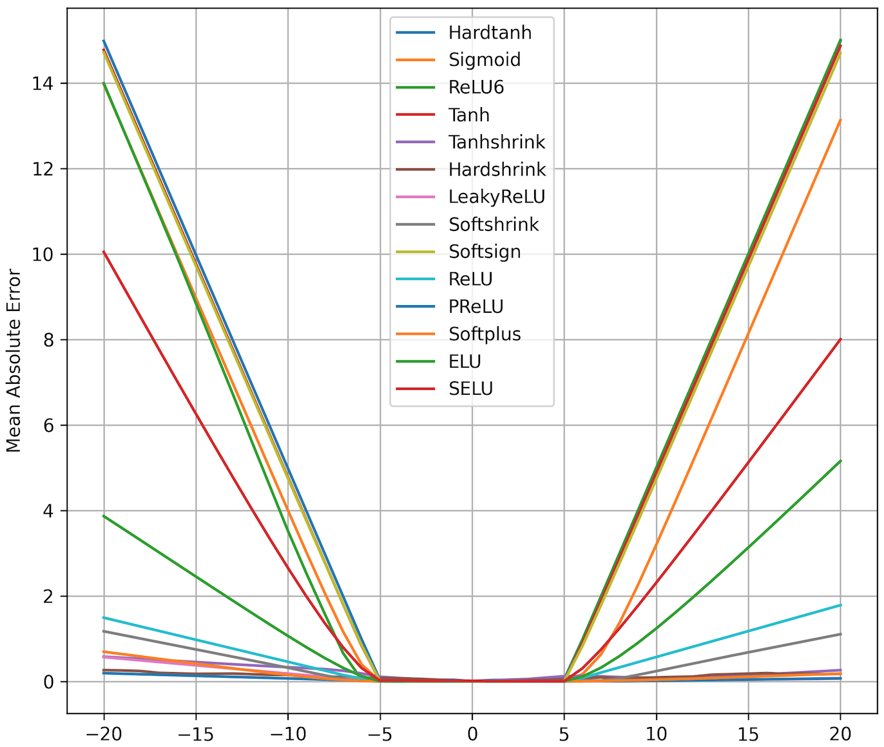

# Neural Arithmetic Logic Units

A PyTorch implementation of [Neural Arithmetic Logic Units](https://arxiv.org/abs/1808.00508) by *Andrew Trask, Felix
Hill, Scott Reed, Jack Rae, Chris Dyer and Phil Blunsom*.

## NAC and NALU architectures

<p align="center">
 
</p>

<div align="center">
  <b>The Neural Accumulator (NAC) is a linear transformation of its inputs. The Neural Arithmetic Logic Unit (NALU) uses two NACs with tied weights to enable addition/subtraction (smaller purple cell) and multiplication/division (larger purple cell), controlled by a gate (orange cell).</b>
</div>


# Experiments

## Experiment 1: Numerical Extrapolation Failures in Neural Networks
MLPs learn the identity function only for the range of values they are trained on. The mean error ramps up severely both below and above the range of numbers seen during training.
Train interval – `[-5, 5]`, Test interval – `[-20, 20]`.

To run first experiment just use
```bash
python3 train_mlp.py
```

#### Results

* Most of the non-linear activation functions used do not cope with extrapolations, except PReLU, which can learn to be highly linear and shows the best results.

<p align="center">
 
 
</p>

<div align="center">
  <b>Left figure – results from the paper, Right figure – actual results.</b>
</div>


